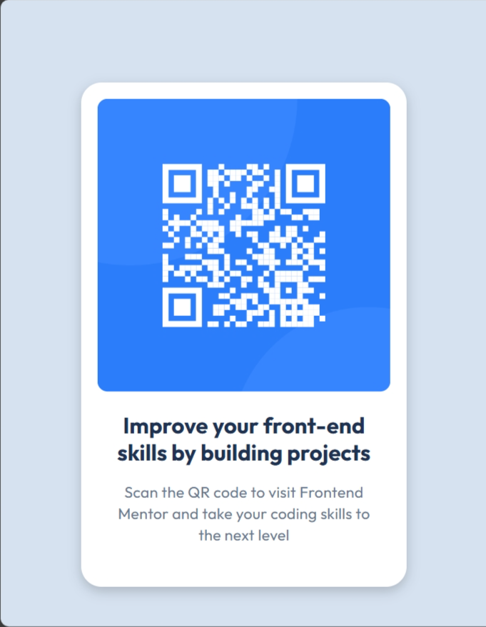

# Frontend Mentor - QR code component solution

This is a solution to the [QR code component challenge on Frontend Mentor](https://www.frontendmentor.io/challenges/qr-code-component-iux_sIO_H). Frontend Mentor challenges help anyone improve their coding skills by building realistic projects. 

## Table of contents

- [Overview](#overview)
  - [Screenshot](#screenshot)
  - [Links](#links)
- [My process](#my-process)
  - [Built with](#built-with)
  - [What I learned](#what-i-learned)
  - [Continued development](#continued-development)
  - [Useful resources](#useful-resources)
- [Author](#author)

## Overview

### Screenshot

Look at how I have completed this challenge, first in the desktop version:

Expectation:

Reality:

Then, in the mobile version:

Expectation:

Reality:

### Links

- Solution URL: [https://github.com/Thomas-Brito/challenge-1](https://github.com/Thomas-Brito/challenge-1)
- Live Site URL: [https://thomas-brito.github.io/challenge-1/](https://thomas-brito.github.io/challenge-1/)

## My process

### Built with

- Semantic HTML5 markup
- CSS custom properties

### What I learned

After a long time away from HTML and CSS, completing this challenge helped me remember how these work and how I can work with them. That is a simple task, I know, but completing it is an important step in my developer career.

### Continued development

I intend to continue increasing my knowledge in HTML and CSS, and add to this the knowledge about other important resources, like JS, PHP, and SQL.

### Useful resources

- [W3Schools.com](https://www.w3schools.com/) - This helped me remember how and when to use certain tags in HTML and certain properties in CSS.
- [RBTech.Info](https://rbtech.info/cursos/) - This website with its courses helped me in different ways, like how to start with Git and GitHub.

## Author

- Frontend Mentor - [@Thomas-Brito](https://www.frontendmentor.io/profile/Thomas-Brito)